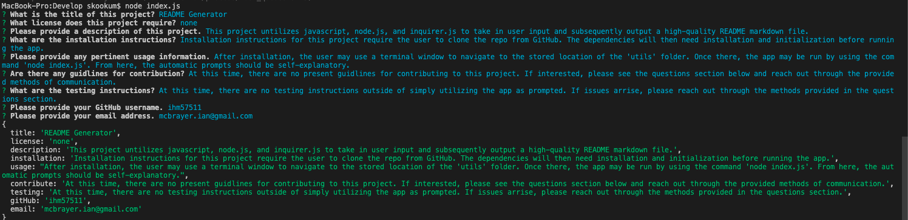

# README Generator  
    
  ## Description  
  This project untilizes javascript, node.js, and inquirer.js to take in user input and subsequently output a high-quality README markdown file.  
  ## View of Application and Link to Demonstration
   
     
  **[VIDEO DEMONSTRATION LINK](https://drive.google.com/file/d/1IbweOz3eIoi0pqffcJW6kXfLtcAYNXIN/view)**
  ## Table of Contents   
  [Installation](##Installation)  
  [Usage](##Usage)  
  [License](##License)  
  [Contributiing](##Contributing)  
  [Tests](##Tests)  
  [Questions](##Questions)
    
  ## Installation  
  Installation instructions for this project require the user to clone the repo from GitHub. The dependency for this application, inquirer, will then need installation before running the app. Simply navigate to the Develop folder in your terminal and run the command `npm i --y`. After inquirer has loaded, the application is ready to run.
  ## Usage  
  After installation, the user may use a terminal window to navigate to the stored location of the 'utils' folder. Once there, the app may be run by using the command 'node index.js'. From here, the automatic prompts should be self-explanatory.  
  ## License   
  This project is not licensed.    
  ## Contributing  
  At this time, there are no present guidlines for contributing to this project. If interested, please see the questions section below and reach out through the provided methods of communication.  
  ## Tests   
  At this time, there are no testing instructions outside of simply utilizing the app as prompted. If issues arrise, please reach out through the methods provided in the questions section.  
  ## Questions  
  I can be reached at mcbrayer.ian@gmail.com for further information.  
  Please feel free to also check me out at https://github.com/ihm57511
